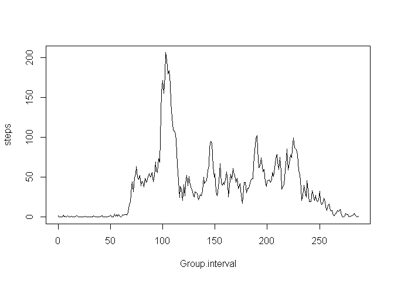

# Reproducible Research: Peer Assessment 1


## Loading and preprocessing the data
The data was obtained as part ot the Peer Assesment 1 from the Git Repo found here at the below USRl. The file is activity.zip which I unzipped to the directory for the git clone.

https://github.com/rdpeng/RepData_PeerAssessment1

Then I set the working directory and read in the file.

The 5 minute intervals are counted using three digits: h:mm where h is the number of hours since the beginning of the day and mm is the number of minutes since the start of the hour. I'd like to number these a bit more intuitively, just going from 0:287 each day. So I'll add a column for that and also for the actual time in HH:MM format.

```r
setwd("~/DataScienceSpec/Reproducible Research/Peer Assignment 1/repo")
raw <- read.table(file="activity.csv",sep=",",header=TRUE)
augmentedRaw <- raw[order(raw$date,raw$interval),]
augmentedRaw$steps <- as.numeric(augmentedRaw$steps)
augmentedRaw$ivs <- 0:287 # five minute intervals each day
augmentedRaw$ivsecs <- augmentedRaw$ivs * 5 * 60 # convert to seconds
augmentedRaw$time <- format(.POSIXct(augmentedRaw$ivsecs,tz="GMT"), "%H:%M")

noNAs <- augmentedRaw[!is.na(raw$steps),]
```

## What is mean total number of steps taken per day?
Note that we will ignore the rows with no data

```r
dailySteps <- aggregate(x=noNAs[c("steps")],by=list(Group.date=noNAs$date),FUN=sum)
dailySteps$steps 
```

```
##  [1]   126 11352 12116 13294 15420 11015 12811  9900 10304 17382 12426
## [12] 15098 10139 15084 13452 10056 11829 10395  8821 13460  8918  8355
## [23]  2492  6778 10119 11458  5018  9819 15414 10600 10571 10439  8334
## [34] 12883  3219 12608 10765  7336    41  5441 14339 15110  8841  4472
## [45] 12787 20427 21194 14478 11834 11162 13646 10183  7047
```

```r
hist(dailySteps$steps,main="Histogram of Daily Steps")
```

 

```r
mn <- as.integer(mean(dailySteps$steps))
md <- as.integer(median(dailySteps$steps))
```
The calcualted mean is 10766 and the median is 10765.
And as a quick check, we'll print the Summary

```r
summary(dailySteps)
```

```
##       Group.date     steps      
##  2012-10-02: 1   Min.   :   41  
##  2012-10-03: 1   1st Qu.: 8841  
##  2012-10-04: 1   Median :10765  
##  2012-10-05: 1   Mean   :10766  
##  2012-10-06: 1   3rd Qu.:13294  
##  2012-10-07: 1   Max.   :21194  
##  (Other)   :47
```

## What is the average daily activity pattern?

```r
intervalMeans <- aggregate(x=noNAs[c("steps")],by=list(Group.interval=noNAs$ivs),FUN=mean)

plot(intervalMeans,type="l")
```

 

```r
maxInterval <- intervalMeans[intervalMeans$steps==max(intervalMeans$steps),1]
```
The interval with the largest average number of steps is: 103

## Imputing missing values
Given that we have rows with missing values, we are going to fill the missing data using the means of the corresponding interval. But first, how many missing values are there?

```r
nRaw <- nrow(raw)
nNotNAs <- nrow(noNAs)
nNAs <- nRaw - nNotNAs
```
There are 2304 rows with no step data.

```r
library(plyr)
```

```
## Warning: package 'plyr' was built under R version 3.1.3
```

```r
newDS <- augmentedRaw
newDS <- ddply(newDS, 
              .(interval), 
              function(df) {
                df$steps[is.na(df$steps)] <- mean(df$steps, na.rm=TRUE); return(df)
                }
              )

ndailySteps <- aggregate(x=newDS[c("steps")],by=list(Group.date=newDS$date),FUN=sum)
ndailySteps$steps 
```

```
##  [1] 10766.19   126.00 11352.00 12116.00 13294.00 15420.00 11015.00
##  [8] 10766.19 12811.00  9900.00 10304.00 17382.00 12426.00 15098.00
## [15] 10139.00 15084.00 13452.00 10056.00 11829.00 10395.00  8821.00
## [22] 13460.00  8918.00  8355.00  2492.00  6778.00 10119.00 11458.00
## [29]  5018.00  9819.00 15414.00 10766.19 10600.00 10571.00 10766.19
## [36] 10439.00  8334.00 12883.00  3219.00 10766.19 10766.19 12608.00
## [43] 10765.00  7336.00 10766.19    41.00  5441.00 14339.00 15110.00
## [50]  8841.00  4472.00 12787.00 20427.00 21194.00 14478.00 11834.00
## [57] 11162.00 13646.00 10183.00  7047.00 10766.19
```

```r
hist(ndailySteps$steps,main="Histogram of Daily Steps with Imputed Data")
```

 

```r
nmn <- as.integer(mean(dailySteps$steps))
nmd <- as.integer(median(dailySteps$steps))
```
The calcualted mean of the new data set with the imputed data is 10766 and the median is 10765. The mean and median have not changed, as expected.

Now lets look at how the number of steps per day has changed. First, we'll compute this with the augmentedRaw data and we'll subtract that from the values just calculated for the imputed data.


```r
rdailySteps <- aggregate(x=augmentedRaw[c("steps")],by=list(Group.date=augmentedRaw$date),FUN=sum)
rdailySteps$steps 
```

```
##  [1]    NA   126 11352 12116 13294 15420 11015    NA 12811  9900 10304
## [12] 17382 12426 15098 10139 15084 13452 10056 11829 10395  8821 13460
## [23]  8918  8355  2492  6778 10119 11458  5018  9819 15414    NA 10600
## [34] 10571    NA 10439  8334 12883  3219    NA    NA 12608 10765  7336
## [45]    NA    41  5441 14339 15110  8841  4472 12787 20427 21194 14478
## [56] 11834 11162 13646 10183  7047    NA
```

```r
ndailySteps$steps - rdailySteps$steps
```

```
##  [1] NA  0  0  0  0  0  0 NA  0  0  0  0  0  0  0  0  0  0  0  0  0  0  0
## [24]  0  0  0  0  0  0  0  0 NA  0  0 NA  0  0  0  0 NA NA  0  0  0 NA  0
## [47]  0  0  0  0  0  0  0  0  0  0  0  0  0  0 NA
```
As you can see above, there is no change to the days that had all of the data as shown by the differences being equal to zero. The only changes are for the days that had no data (all NAs). The values for those missing days are shown above in ndailySteps$steps.

## Are there differences in activity patterns between weekdays and weekends?

First, lets create a factor to identify weekend days from days during the week. We'' convert the date text to a date object and wee if it is either a Saturday or Sunday and mark those as "weekend". Then we'll mark everything else as "weekday". Finally, we'll check the summary to be sure we have the factor with two levels as needed.

```r
newDS$weekOrEnd <- 
  ifelse( ((weekdays(as.Date(newDS$date)) == "Saturday") | 
           (weekdays(as.Date(newDS$date)) == "Sunday")),
         "weekend", 
         "weekday")

newDS$weekOrEnd <- as.factor(newDS$weekOrEnd)
summary(newDS$weekOrEnd)
```

```
## weekday weekend 
##   12960    4608
```

```r
weekday <- newDS[newDS$weekOrEnd=="weekday",]
weekend <- newDS[newDS$weekOrEnd=="weekend",]

weekendMeans <- aggregate(x=weekend[c("steps")],by=list(Group.interval=weekend$ivs),FUN=mean)
weekdayMeans <- aggregate(x=weekday[c("steps")],by=list(Group.interval=weekday$ivs),FUN=mean)
```
Now we have the data we need, so we'll plot them for easy comparison.

```r
par(mfrow=c(2,1))
plot(weekdayMeans,type="l",ylab="Average Steps",main="Weekday Average Steps by Interval")
plot(weekendMeans,type="l",ylab="Average Steps",main="Weekend Average Steps by Interval")
```

 
